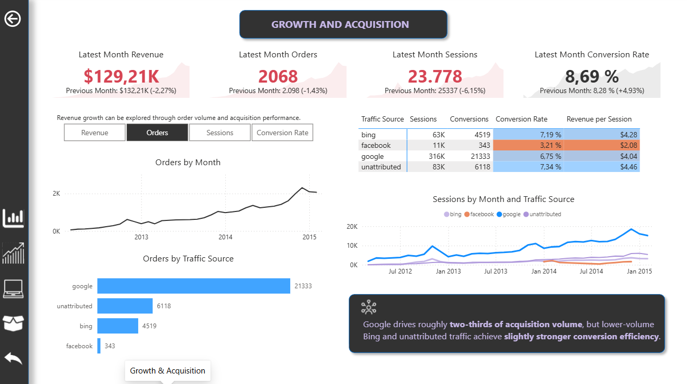
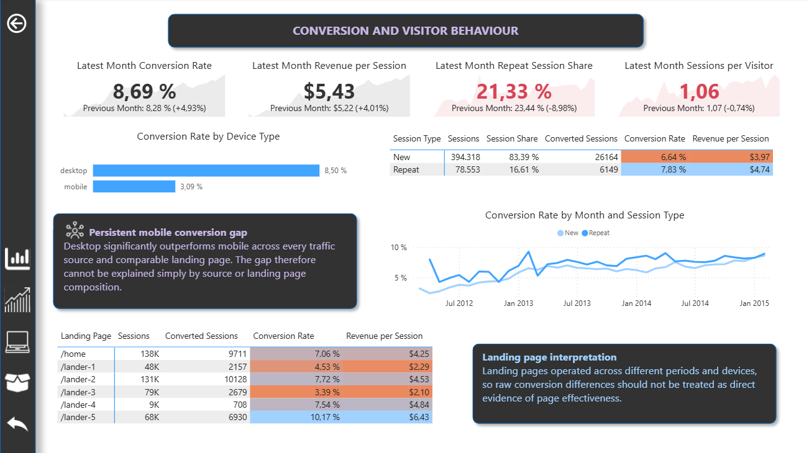
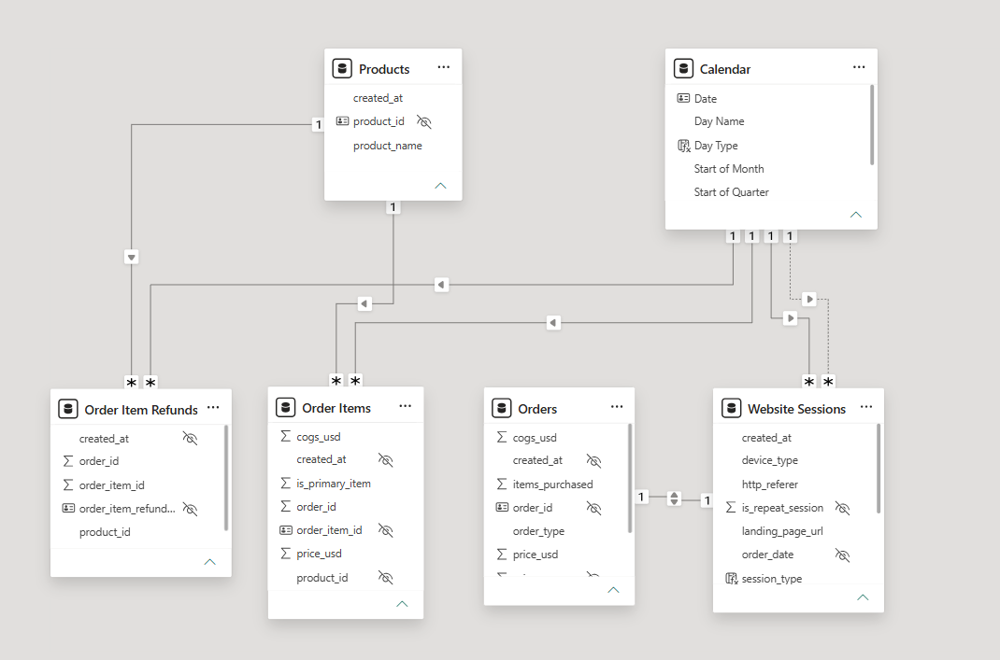

# E-Commerce Growth Intelligence in Power BI: Revenue, Conversion & Product Economics

# Summary/Introduction

This project analyzes the complete customer journey of an online retailer, from website visit through purchase and eventually to refund, to identify opportunities for improving business performance. 

An end-to-end analysis involves the growth and performance of the retailer across sales, website traffic, conversion, product performance, basket behavior, and refunds. The project goes beyond dashboard creation by combining data validation, semantic modeling, KPI design, exploratory analysis, and business recommendations in Power BI. The objective is to identify the key drivers of these topics and to present actionable insights through an interactive Power BI dashboard.

# Business Problem

An online toy retailer is selling products directly through its website. Revenue is generated through online product sales. The dataset captures the customer journey from website visit through purchase and eventually to refund.

Key business questions include:

- What drove revenue growth over time — higher traffic, stronger conversion, or increasing order value?
- How have orders, sessions, conversion rate, and Average Order Value evolved over time?
- Which traffic sources contribute the most acquisition volume, and which generate the strongest conversion efficiency and revenue per session?
- How does conversion performance differ between desktop and mobile, and does the device gap persist across traffic sources and comparable landing pages?
- How do new and repeat sessions differ in conversion and revenue efficiency, and did changes in repeat-session behavior contribute to overall conversion improvement?
- Which products drive revenue and gross profit, and how has their relative contribution changed as the portfolio expanded?
- How do product margin and refund risk differ across the portfolio?
- How important are bundle purchases to order value and revenue, and what drove the increase in AOV?
- Which landing pages attract the most traffic and conversions, and to what extent can differences in performance be explained by device composition and operating period?
- How have refund losses changed as the business has grown?
- Are refund losses and refund rate concentrated in specific products?
- Were major refund spikes caused by broad deterioration or isolated product-specific anomalies?

# Dashboard Preview

Report pages:
- Executive Summary

- Revenue & Growth

- Conversion & Visitor Behaviour

- Product & Basket Performance

# Data & Analytical Scope

The model combines multiple business processes at different analytical grains, including:
- 472K+ website sessions
- 1.18M+ pageviews
- 32K+ orders
- 40K+ order items
- product and order-item refund data

The source data was profiled for missing values, duplicates, integrity, business rule consistency, and appropriate data types before semantic modeling. It is worth to mention that the dataset does not contain marketing spend, geography, customer demographics, inventory, or shipping information. Recommendations are therefore limited to conclusions supported by the available data.

# Power BI & Technical Implementation

Tools: 
- Power BI
- Power Query
- DAX

The semantic model separates business processes operating at different grains:

- Website Sessions for acquisition and conversion analysis
- Orders for order-level sales economics
- Order Items for product-level performance
- Refunds for return activity
- Calendar for consistent time intelligence

A dedicated KPI framework separates Session Date, Order Date, Product Sale Date, and Refund Date, preventing misleading comparisons across different business processes.

Key techniques include:

- [Data profiling and validation](Docs/02_Data_Audit.md)
- Power Query transformation
- [Fact constellation modeling](Images/Screenshots/modelling.png)
- Dedicated Calendar table
- Explicit DAX measures, including USERELATIONSHIP for alternate date roles
- Time intelligence: Previous Month, Month-over-month and YTD 
- [KPI Framework](Docs/03_KPI_Framework.md) and business driver decomposition
- Cross-filtered acquisition, conversion, product, and refund analysis

# Key Business Insights

### Growth was primarily volume-driven
- Revenue growth was driven mainly by increasing orders and traffic, while conversion became a more important growth driver during the later period.

### Mobile is the clearest conversion opportunity
- Desktop converts at approximately 8.5% compared with 3.1% on mobile and generates roughly 2.7 times more revenue per session. The gap persists within individual traffic sources and comparable landing pages.

### Acquisition is heavily concentrated in Google
- Google generates roughly two thirds of website sessions, making it the primary acquisition source but also creating channel concentration risk.

### Bundle purchasing significantly increases transaction value
- Bundle purchases represent approximately 24% of orders but 36% of revenue, with Average Order Value around 76% higher than single item orders.

### Product performance goes beyond revenue
- The Original Mr. Fuzzy leads in both revenue and profit, while the other products show different margin and refund patterns.

### Refund performance differs across products
- Refunds generally increased in line with business growth, but two issues stand out: a sharp Mr. Fuzzy refund spike in September 2014 and a consistently higher refund rate for Birthday Sugar Panda.

For a deeper analysis, see [Insights and Business Recommendations](Docs/04_Insights_and_Business_Recommendations.md).
# Recommended Business Priorities

Based on the analysis, the highest value opportunities are to:
- Investigate the mobile conversion journey and identify sources of mobile drop-off.
- Reduce acquisition concentration while preserving Google's contribution to scale.
- Strengthen bundle and cross-sell strategies to increase basket value.
- Analyze refund drivers at the product level rather than assuming the problem affects the whole portfolio.
- Continue product diversification while evaluating revenue, margin, and refund risk together.
- Use controlled testing before attributing landing-page conversion differences to page design.

Detailed findings and recommendations are available in [Insights and Business Recommendations](Docs/04_Insights_and_Business_Recommendations.md).